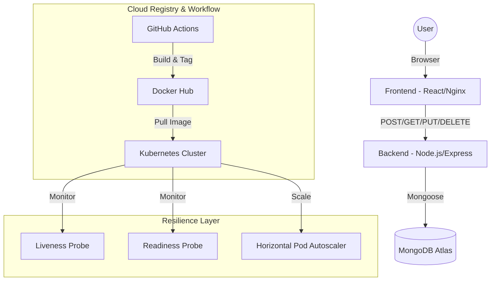

# TaskFlow: Technical Documentation & System Design

This document provides a comprehensive technical deep-dive into the **TaskFlow** project. It covers the architecture, the technology stack, the API specification, and the cloud-native infrastructure.

---

## 1. Project Overview
TaskFlow is a cloud-native task management application designed to demonstrate the full lifecycle of a modern web application. The primary focus is on **resilience**, **scalability**, and **automated operations**.

### Core Objectives:
- **Scalability**: Capable of handling high traffic via Kubernetes Auto-scaling.
- **Reliability**: Self-healing infrastructure using health probes and graceful shutdowns.
- **Security**: Industry-standard authentication (JWT) and encryption (Bcrypt).
- **Automation**: Fully automated CI/CD pipeline for testing and deployment.

---

## 2. Architecture Diagram

---

## 3. Technology Stack Deep-Dive

### Frontend: React & Vite
- **Modern UI**: Uses **Glassmorphism** for a futuristic, transparent card-based design.
- **State Management**: React Hooks (`useState`, `useEffect`) manage user authentication and task filtering.
- **Routing**: `react-router-dom` handles navigation between Login, Register, and Dashboard.
- **Animations**: `framer-motion` provides smooth entrance and exit animations for tasks and modals.
- **HTTP Client**: `axios` is configured with a base URL/proxy for seamless API communication.

### Backend: Node.js & Express
- **RESTful API**: Clean separation of concerns between `routes`, `controllers`, and `models`.
- **Stateless Auth**: Uses **JSON Web Tokens (JWT)** for secure, session-less authorization.
- **Middleware**: Custom error handling and authentication guard middleware ensure endpoint security.
- **Security**: **Bcrypt.js** hashes passwords with a salt factor of 10 before storage.

### Database: MongoDB
- **NoSQL Schema**: flexible document storage ideal for task metadata.
- **Mongoose ODM**: Provides robust schema validation and easy-to-use search queries.

---

## 4. API Specification

### Authentication Routes
- `POST /api/auth/register`: Creates a new user account.
- `POST /api/auth/login`: Authenticates user and returns a JWT token.

### Task Management Routes
- `GET /api/tasks`: Retrieves all tasks for the authenticated user. Includes support for filtering on the frontend.
- `POST /api/tasks`: Creates a new task (Required: Title, Priority).
- `PUT /api/tasks/:id`: Updates task status (Pending → In-Progress → Completed).
- `DELETE /api/tasks/:id`: Permanently removes a task.

---

## 5. Cloud-Native & DevOps Features

### Containerization (Docker)
- **Multi-Stage Builds**: The frontend `Dockerfile` uses a build stage (Node) and a serve stage (Nginx) to keep the final image small and secure.
- **Environment Isolation**: `.env` files manage configurations across local, docker, and cloud environments.

### Orchestration (Kubernetes)
- **Self-Healing**: `livenessProbe` checks if the process is alive; `readinessProbe` checks if the DB is connected before sending traffic.
- **Auto-Scaling**: The **HorizontalPodAutoscaler (HPA)** scales the backend from 2 to 10 replicas based on CPU usage.
- **Graceful Shutdown**: The backend captures `SIGTERM` signals to close MongoDB connections before the pod stops, preventing data corruption.

### CI/CD (GitHub Actions)
- **Automated Quality Control**: Every push triggers a workflow that installs dependencies, runs unit tests, and builds Docker images.

---

## 6. Future Roadmap: AWS Integration
The project is architecturally ready for **Amazon Web Services (AWS)** migration:
1.  **AWS EKS**: Replacing local Kubernetes with a managed cluster.
2.  **AWS ECR**: Using a private AWS container registry for image security.
3.  **AWS Managed MongoDB**: Migrating data to a dedicated AWS-hosted database.

---

## 📄 Setup & Execution
Detailed setup instructions for Local and Docker environments can be found in the [README.md](./README.md).
