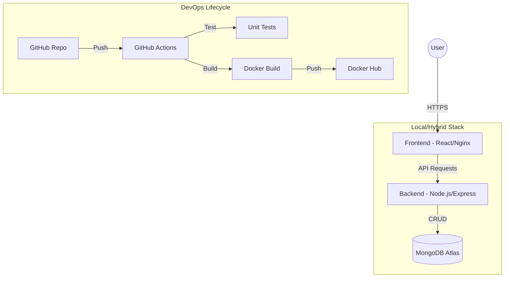

# TaskFlow: Cloud-Native Task Management System

TaskFlow is a high-performance, full-stack task management application designed for modern cloud environments. It demonstrates a complete "Cloud-Native" lifecycle—from containerized local development to automated CI/CD and Kubernetes orchestration.

## 🏗️ Architecture Diagram



---

## 🛠️ Detailed Tech Stack

### 🔹 Frontend (The Client Layer)
- **React.js & Vite**: Using Vite for ultra-fast build times and React for a component-based, reactive UI.
- **Framer Motion**: Smooth, high-end animations (e.g., card entrance, modal transitions) to create a premium user experience.
- **Lucide Icons**: A modern icon set for a clean, professional aesthetic.
- **Glassmorphism UI**: Custom CSS to create a sleek, transparent card-based design with deep blur effects.

### 🔹 Backend (The Logic Layer)
- **Node.js & Express**: A lightweight, scalable server environment for handling API requests and business logic.
- **Mongoose**: An ODM (Object Data Modeling) library for MongoDB, providing schema validation and easy database interaction.
- **JWT (JSON Web Tokens)**: Secure, stateless authentication for user login sessions.
- **Bcrypt.js**: Industry-standard password hashing before storing credentials in the database.

### 🔹 Database (The Data Layer)
- **MongoDB Atlas**: A managed cloud database (DBaaS) that provides high availability and scalability.
- **Local MongoDB**: Configured for offline development and testing.

### 🔹 DevOps & Infrastructure (The Cloud-Native Core)
- **Docker**: Containerizing the frontend and backend to ensure "it works on my machine" translates to "it works everywhere."
- **Kubernetes (K8s)**: Orchestrating containers with **Liveness/Readiness probes** (self-healing) and **Auto-scaling (HPA)**.
- **GitHub Actions**: Automating the entire CI/CD pipeline—testing, building, and pushing images on every commit.

---

## ☁️ The AWS Advantage (Future Roadmap)

While currently running in a Hybrid Local/Cloud mode, TaskFlow is architected to scale directly into **Amazon Web Services (AWS)**:

- **AWS EKS (Elastic Kubernetes Service)**: To manage our Kubernetes cluster in a production environment with automatic patching and scaling.
- **AWS ECR (Elastic Container Registry)**: For high-speed, private storage of our Docker images.
- **AWS Load Balancers**: To distribute traffic globally across multiple Availability Zones.

---

## 🚦 Getting Started

### 1. Local Setup
```bash
# Start Backend
cd backend
npm install
node server.js

# Start Frontend
cd ../frontend
npm install
npm run dev
```

### 2. Docker Execution
```bash
docker-compose up --build
```

### 3. Kubernetes Deployment
Ensure your cluster is active (Minikube/Kind), then:
```bash
kubectl apply -f k8s/
```

## 📄 License
This project is licensed under the MIT License.
